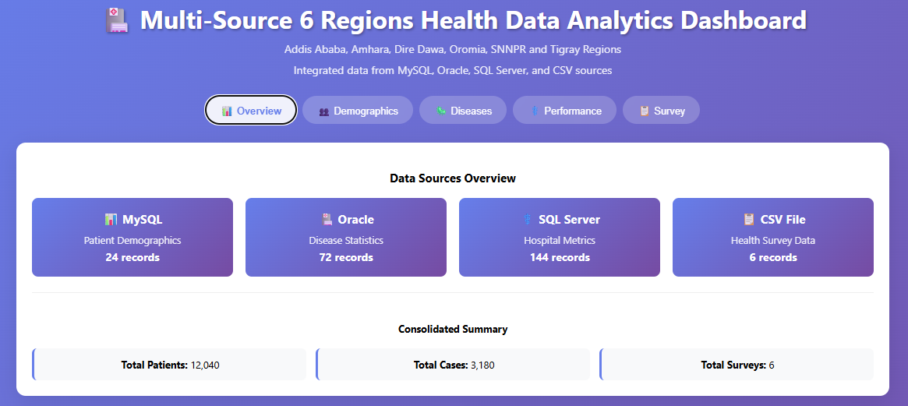

# 🏥 Ethiopia Health Data Analytics Dashboard

<div align="center">


A comprehensive full-stack health data engineering platform integrating multiple data sources for Ethiopian public health analytics.

[](https://your-live-demo-link)
[](https://your-video-link)

</div>

---

## 📊 Dashboard Preview
<div align="center">

🎯 **Interactive Health Data Visualization**



_Actual dashboard showing multi-source health data integration._

</div>

---

## 🌟 Project Overview
This is a **production-ready health data analytics platform** demonstrating advanced data engineering and visualization. It integrates **four data sources** and presents analytics for **6 key Ethiopian regions**, relevant to institutions such as **EPHI (Ethiopian Public Health Institute)**.

---

## 🎯 Key Features
- 🔗 **Multi-Source Integration:** MySQL, Oracle, SQL Server & CSV
- 📈 **Advanced Visualizations:** Line, Bar, Pie, and Scatter charts using Recharts
- 🏥 **Regional Analytics:** Real data modeling for six Ethiopian regions
- ⚡ **Real-Time Processing:** Dynamic aggregation and visualization
- 🧱 **Scalable Architecture:** Flask API + React frontend

---

## 🗺️ Supported Ethiopian Regions (Synthetic data)

| Region        | Capital       | Health Index | Vaccination |
|----------------|----------------|---------------|--------------|
| Addis Ababa   | Addis Ababa   | 65 | 78% |
| Amhara        | Bahir Dar     | 56 | 65% |
| Dire Dawa     | Dire Dawa     | 60 | 64% |
| Oromia        | Adama         | 58 | 58% |
| SNNPR         | Hawassa       | 65 | 52% |
| Tigray        | Mekelle       | 62 | 61% |

---

## 🛠️ Technology Stack

### 🔹 Backend (Flask)
Framework: Flask 2.3.3 (Python)
* Database Connectors:
  - MySQL: mysql-connector-python
  - Oracle: cx_Oracle
  - SQL Server: pyodbc
  - CSV: pandas
* API: RESTful JSON API
* CORS: Flask-CORS enabled

### 🔹 Frontend (React + Recharts)
  - Framework: React 18.2.0
  - Visualization: Recharts 2.8.0
  - HTTP Client: Axios 1.5.0
  - Styling: CSS3 with Gradient Design
  - Build Tool: Create React App

### 🔹 Data Sources
  - MySQL: Patient Demographics & Regional Data
  - Oracle: Disease Statistics & Epidemiology
  - SQL Server: Hospital Performance Metrics
  - CSV: Public Health Survey Data

### 🚀 Quick Start Guide
## 🔧 Prerequisites
 - Python 3.10+
 - React + Recharts
 - VS Code (recommended)
 - Modern browser (chrome recommended)

1️⃣ Clone and Setup
```yaml
git clone https://github.com/ake369/health-data-dashboard.git
cd health-data-dashboard
```
2️⃣ Backend Setup
```yaml
cd backend
python -m venv venv
source venv/bin/activate  # or venv\Scripts\activate (Windows)
pip install -r requirements.txt
python app.py
# ✅ Runs at http://localhost:5000
```
3️⃣ Frontend Setup
```yaml
cd frontend
npm install
npm start
# ✅ Runs at http://localhost:3000
```

### 🚀 Deployment Options
## Local
```yaml
# Run backend
cd backend 
python app.py
# Run frontend
cd frontend 
npm start
```

### Contact
📧 Email: ake.abrish@gmail.com
💼 LinkedIn: https://www.linkedin.com/in/akaluabraham/